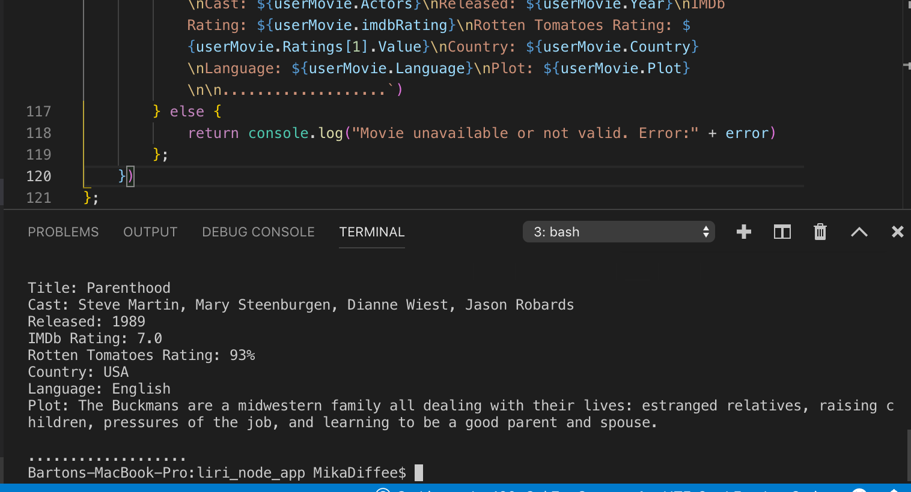

# liri_node_app
Bands in Town, OMDB &amp; Spotify 

Description & Requirements
Liri is a command line application that takes user commands and queries from the command line and returns data from API's. The following commands have been hard coded into the program to give the user the capability to look up songs and movie information:
Before you get started, make sure you have these node packages installed:
Dotenv: Dotenv is a zero-dependency module that loads environment variables from a .env file into process.env. Storing configuration in the environment separate from code is based on The Twelve-Factor App methodology.
Command Line: 'npm install dotenv'

Request: - Request is designed to be the simplest way possible to make http calls. It supports HTTPS and follows redirects by default.
Command Line: 'npm install request'

Moment: - A lightweight JavaScript date library for parsing, validating, manipulating, and formatting dates.
Command Line: 'npm install moment'

Fs: - a built in node package
(npm i request)


Running Node liri.js movie-this results above.
